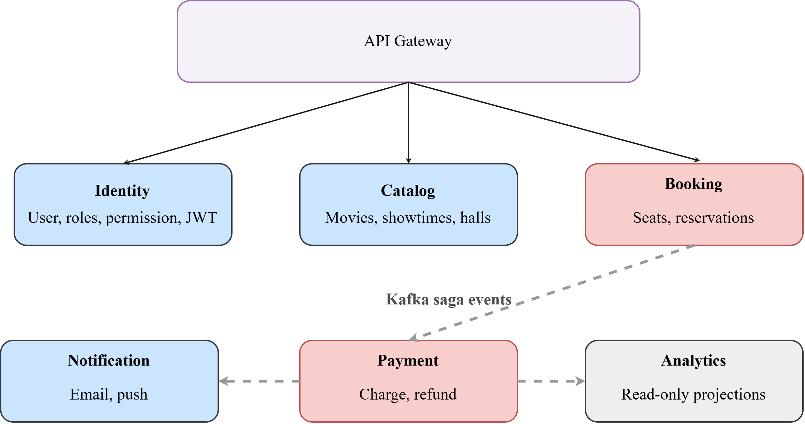
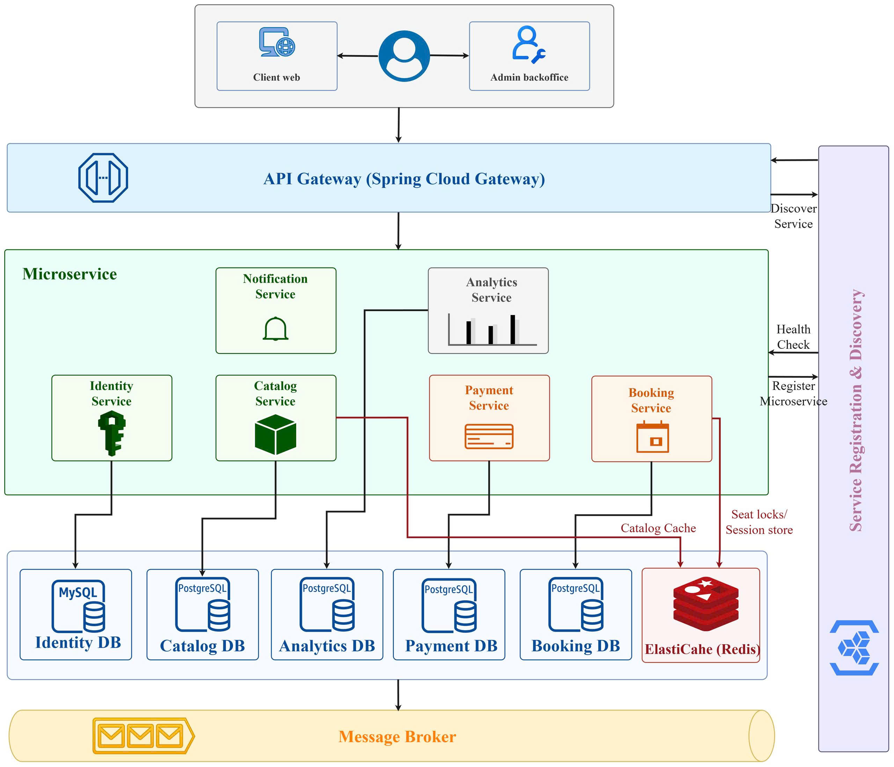

# Bounded context: Theater Microservice

- Here is the bounded context map:
  - Blue block: Supporting domain
  - Red block: Core domain
  - Gray block: Generic domain
  - Straight lines: REST
  - Dashed lines: Asynchronous communication (Message queues/events)
    

# High level architecture:
]

# Microservices breakdown

Seven services map cleanly to the bounded contexts. The reasoning for each boundary is deliberate:

- `identity-service` owns user registration, login, token issuance, and refresh. It is the only service
  that writes to the users store. Decoupled from Booking deliberately — if auth is down, the booking
  system can still process pre-authenticated requests with valid JWTs.
- `catalog-service` owns movies, cinemas, halls, and showtimes. It is read-heavy (10:1 read/write
  ratio) which makes it the primary beneficiary of caching. Operators write to it; customers read
  from it.
- `booking-service` is the most complex service. It manages the seat reservation state machine:
  AVAILABLE → LOCKED → RESERVED → CONFIRMED → CANCELLED. Seat locking uses Redis distributed locks
  (TTL-based, 8 minutes) to handle the concurrent selection window. This is the service that
  initiates the Saga.
- `payment-service` receives BookingConfirmed events, processes the Stripe charge, and emits
  PaymentSucceeded or PaymentFailed back. It never calls Booking directly — the Saga orchestrator
  handles compensation.
- `notification-service` is a pure consumer. It subscribes to domain events (BookingConfirmed,
  PaymentSucceeded, PaymentFailed, ShowtimeReminder) and dispatches via the appropriate channel.
  Stateless and easily scaled.
- `analytics-service` consumes all domain events and materializes read-model projections into a
  separate read store. It has no write path from the API — this enforces CQRS at the service
  boundary and prevents reporting queries from impacting transactional databases.
- `api-gateway` (using AWS API Gateway + a custom Lambda authorizer, or a self-hosted Kong/Nginx on
  EKS) handles JWT validation, rate limiting, routing, and request logging before forwarding to
  services.

# Database-per-service strategy

Each service owns its data store. No service may query another's database directly — all cross-service
reads go through published events or API calls.

- `identity-service` → MySQL (relational, strong consistency for user records, RBAC)
- `catalog-service` → PostgreSQL (relational for structured movie/hall data) + Redis cache on top
- `booking-service` → PostgreSQL (reservations, audit log) + Redis (distributed seat locks,
  WebSocket session state)
- `payment-service` → PostgreSQL (payment records, idempotency keys — critical for preventing
  double-charges)
- `notification-service` → No persistent store needed; uses Kafka consumer offsets for delivery
  tracking
- `analytics-service` → PostgreSQL with materialized views (or optionally a time-series store like
  TimescaleDB for occupancy trends)

The tradeoff here is explicit: cross-service joins are impossible at the DB layer. The design
resolves this via event-driven data denormalization — the analytics service maintains its own
denormalized projection of booking + payment data, purpose-built for reporting queries.

# Sync vs async communication strategy

- The communication strategy follows a simple rule: use sync (REST/gRPC) when you need an immediate response; use async (Kafka) for everything that can tolerate eventual consistency.
- Sync paths: customer browsing catalog, seat map rendering, JWT validation, seat lock acquisition (needs immediate confirmation). These are request/response flows where the client waits.
- Async paths: booking confirmation → payment processing → notification dispatch → analytics ingestion. Once a seat is locked and the user confirms, the downstream chain (charge card, send email, update dashboards) happens asynchronously. The user gets an optimistic "booking received" screen; confirmation arrives via push notification when the Saga completes.
- The critical tradeoff: async Saga means a user could receive a "payment failed" notification after seeing "booking confirmed." This is explicitly acceptable per the Saga consistency model selected. The compensating transaction cancels the reservation and returns seats to `AVAILABLE`.
