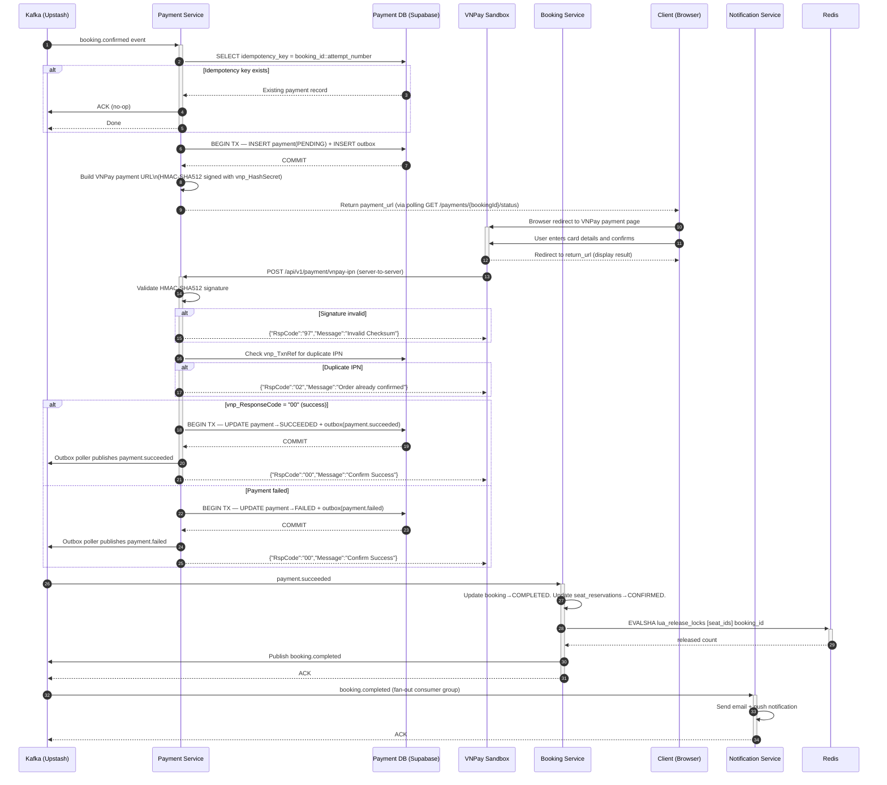

# Transformation Prompt — Cinema Platform: Student Edition Refactor

## Context

You are a senior software architect helping a university student refactor a production-grade Cinema Management Platform architecture document. The goal is to **preserve the microservices and DDD/Clean Architecture integrity** while replacing enterprise-only components with free-tier equivalents suitable for a graduation capstone project.

The attached document is the **source of truth**. Apply every change described below. Do not invent new content unless explicitly instructed. Output a complete `.docx` file with all changes applied.

---

## Input

The attached file: `booking-payment-architecture-deepdive.docx`

---

## Output

A fully rewritten `.docx` file named: `booking-payment-architecture-student-edition.docx`

The output must:
- Keep the same document structure, section numbering, and table of contents
- Apply all technology replacements described below throughout the entire document
- Update every code snippet, table, diagram, config, and prose paragraph that references replaced technology
- Add new sections where instructed
- Remove sections where instructed

---

## Global Find-and-Replace Rules

Apply these substitutions **everywhere** they appear — in prose, tables, code blocks, diagrams, section titles, callout boxes, and footnotes.

| Find (Original) | Replace With | Notes |
|---|---|---|
| AWS EKS | Docker Compose (local) / Kubernetes (future) | |
| AWS RDS (PostgreSQL 16) / RDS Multi-AZ | Supabase (PostgreSQL 15) | Remove all Multi-AZ references |
| AWS ElastiCache (Redis 7) | Upstash Redis (free tier) | |
| AWS MSK / Kafka 3.x | Upstash Kafka (free tier) | |
| AWS Secrets Manager / KMS | Docker Compose environment variables / `.env` file | |
| AWS API Gateway | — (removed; Spring Cloud Gateway handles this) | |
| Kong API Gateway | Spring Cloud Gateway | Update all Kong-specific configs |
| Stripe / Stripe API / Stripe Java SDK | VNPay (sandbox) | See VNPay-specific rules below |
| PgBouncer | — (removed; Supabase connection pooler is built-in via Supavisor) | |
| Schema Registry (Confluent / Avro) | Plain JSON (Jackson) | Remove all Avro schema sections |
| KEDA autoscaling | — (removed) | |
| Multi-AZ / High Availability | — (removed; note: HA deferred to production phase) | |
| RLS (Row Level Security) | — (removed) | Remove all RLS policy DDL |
| PCI-DSS / PCI-Related / SAQ A | — (removed or simplified to: "payment data handled entirely by VNPay") | |
| Confluent Schema Registry | — (removed) | |
| Prometheus + Grafana + Jaeger | Prometheus + Grafana + Loki + Tempo | See Observability section below |
| ElasticSearch / ELK | — (not used) | |
| pdftoppm / PDF generation | — (not referenced) | |
| ROLE_SERVICE (inter-service JWT) | — (removed; use Docker Compose internal network trust) | |
| External Secrets Operator | — (removed) | |
| CloudFront | — (removed; not applicable for local deployment) | |
| WAF | — (removed) | |

---

## Section-by-Section Instructions

### Cover Page / Document Metadata Table

Update the metadata table:

| Field | New Value |
|---|---|
| Document Type | Service Deep-Dive — Booking & Payment (Student Edition) |
| Phase | 2 — Core Service Architecture |
| Cloud Target | Docker Compose (local) · Supabase · Upstash Redis · Upstash Kafka |
| Status | Phase 2 Draft — Student Edition |

Add a new row: **Edition** → `Student Edition — Free-Tier Stack`

---

### Section 1 — Service Responsibilities

#### 1.2 Payment Service — rewrite these specific bullets:

REMOVE:
- "Subscribe exclusively to the `booking.confirmed` Kafka topic for charge triggers"
- "Execute Stripe PaymentIntent charge with idempotency key (`booking_id + attempt_number`)"
- "Store encrypted Stripe PaymentMethod references — never raw card data"
- All bullets mentioning Stripe

REPLACE WITH:
- "Subscribe to the `booking.confirmed` Kafka topic for payment triggers"
- "Initiate VNPay payment URL generation and redirect the client to VNPay sandbox checkout"
- "Receive and verify VNPay IPN (Instant Payment Notification) callback via a dedicated REST endpoint"
- "Validate VNPay HMAC-SHA512 signature on every IPN request"
- "Persist payment records (status, VNPay transaction reference, amount) to its own PostgreSQL instance (Supabase)"
- "Publish `payment.succeeded` or `payment.failed` to Kafka on each terminal payment state"
- "Implement the Transactional Outbox pattern for guaranteed Kafka event delivery"
- "Enforce idempotency at the service level independent of Kafka delivery semantics"

#### 1.2 Out of Scope — add:
- "Raw payment card data — VNPay handles all card data on their hosted page (redirect flow)"

---

### Section 2 — Internal Module Design

#### 2.2 Payment Service — Module Layout table

Replace the `payment.infra.stripe` row entirely:

| Layer | Module / Package | Responsibilities |
|---|---|---|
| Infrastructure | payment.infra.vnpay | `VNPayGateway`: builds VNPay payment URL (HMAC-SHA512 signed). Verifies IPN callback signature. Maps VNPay response codes to domain events. |
| Infrastructure | payment.infra.ipn | `VNPayIpnController`: REST endpoint `POST /api/v1/payment/vnpay-ipn`. Receives VNPay server-to-server callback. Validates signature, then delegates to application layer. |

Replace the `payment.infra.encryption` row:

| Layer | Module / Package | Responsibilities |
|---|---|---|
| Infrastructure | payment.infra.persistence | JPA repositories, Outbox table writer. IdempotencyKey table for de-duplication. Supabase PostgreSQL connection via Spring Data JPA. |

---

### Section 3 — Database Schema Design

#### Constraint box — update text to:
> Each service owns its own logical schema within Supabase (PostgreSQL 15). No cross-service JOINs. Cross-service reads are via Kafka events or REST only.

#### 3.1 Booking Service — DDL

- Remove the `PgBouncer-aware` comment
- Remove the monthly partition creation statements (`bookings_2025_01`, `bookings_2025_02`) — keep the `PARTITION BY RANGE` declaration but add comment: `-- Partitions managed manually or via pg_partman (future)`
- Remove all `RLS` / `ROW LEVEL SECURITY` statements
- Keep all other DDL unchanged

#### 3.2 Payment Service — DDL

- Remove `payment_method_token BYTEA` column (raw token storage no longer needed; VNPay redirect flow)
- Add new column to `payments` table:
```sql
vnpay_txn_ref         VARCHAR(255),              -- VNPay transaction reference (vnp_TxnRef)
vnpay_transaction_no  VARCHAR(255),              -- VNPay internal transaction ID (vnp_TransactionNo)
vnpay_response_code   VARCHAR(10),               -- vnp_ResponseCode from IPN
vnpay_bank_code       VARCHAR(20),               -- Issuing bank code from VNPay
```
- Remove `payment_gateway ENUM ('STRIPE')` → replace with:
```sql
CREATE TYPE payment_gateway AS ENUM ('VNPAY');
```
- Remove ALL `ROW LEVEL SECURITY` and `CREATE POLICY` statements
- Remove the `-- ROW-LEVEL SECURITY (PCI boundary)` comment block entirely

---

### Section 4 — Redis Strategy

#### 4.1 Seat Lock Key Design table — add a note row at the bottom:
> **Note (Student Edition):** Upstash Redis free tier supports up to 10,000 commands/day and 256MB storage. Seat lock TTL (480s) and map cache (60s) are well within limits for demo/staging traffic.

#### 4.4 Distributed Locking — table row update:
- Find row: "Redis node failover during lock" → update **Prevention Mechanism** to:
  > Upstash Redis provides automatic replication. For local Docker Compose: single Redis instance acceptable for demo. Note as known limitation in README.

---

### Section 5 — API Design

#### 5.1 Booking Service — REST Endpoints table — no changes needed.

#### New subsection to add after 5.1 — **5.1a Payment Service — REST Endpoints**:

Insert this new subsection:

```
5.1a  Payment Service — REST Endpoints

| Method | Path | Description | Auth / RBAC |
|---|---|---|---|
| POST | /api/v1/payments/initiate | Triggered internally after booking.confirmed consumed. Generates VNPay payment URL. Returns redirect URL to client via WebSocket or polling. | Internal (no direct client call) |
| POST | /api/v1/payment/vnpay-ipn | VNPay IPN callback endpoint. Server-to-server only. Validates HMAC-SHA512 signature. Delegates to application layer. | No JWT — IP whitelist (VNPay IPs) + signature validation |
| GET | /api/v1/payments/{bookingId}/status | Poll payment status for a given booking. Used by client while waiting for VNPay redirect return. | JWT — ROLE_CUSTOMER (own) |

Note: VNPay IPN endpoint must be publicly accessible (VNPay calls it server-to-server). In local dev, use ngrok or similar tunneling tool to expose the endpoint.
```

#### 5.2 Request/Response Payloads

Replace the Stripe `payment_method_token` field in the `POST /api/v1/bookings` request body:

REMOVE:
```json
"payment_method_token": "pm_xxx"
```

REPLACE WITH:
```json
"return_url": "https://yourapp.com/booking/result"
```

Add a new response payload example after the confirm booking request:

```
POST /api/v1/payments/initiate — Response (200 OK)
{
  "payment_url": "https://sandbox.vnpayment.vn/paymentv2/vpcpay.html?vnp_Amount=...",
  "booking_id": "uuid",
  "expires_at": "2025-01-15T14:08:00Z",
  "vnp_txn_ref": "uuid-truncated-15chars"
}

VNPay IPN Callback — Incoming (from VNPay server):
{
  "vnp_Amount": "3700000",
  "vnp_BankCode": "NCB",
  "vnp_BankTranNo": "VNP...",
  "vnp_CardType": "ATM",
  "vnp_OrderInfo": "Thanh toan booking uuid",
  "vnp_PayDate": "20250115140800",
  "vnp_ResponseCode": "00",
  "vnp_TmnCode": "YOUR_TMN_CODE",
  "vnp_TransactionNo": "14057285",
  "vnp_TransactionStatus": "00",
  "vnp_TxnRef": "booking-uuid-ref",
  "vnp_SecureHash": "hmac_sha512_signature"
}

VNPay IPN Response (Payment Service → VNPay):
{"RspCode": "00", "Message": "Confirm Success"}
```

#### 5.3 Validation Strategy — add row to table:

| Field | Rule | Implementation |
|---|---|---|
| vnp_SecureHash | HMAC-SHA512 computed with VNPay secret key; must match incoming hash | Computed server-side in `VNPayGateway.verifyIpnSignature()` before any processing |
| vnp_ResponseCode | Must equal `"00"` for success | Checked in `ProcessPaymentCommand` handler |

#### 5.7 Rate Limiting — update Kong references to Spring Cloud Gateway:

Replace all "Kong rate-limiting plugin" references with:
> Spring Cloud Gateway `RequestRateLimiter` filter (backed by Upstash Redis)

Replace "Kong token-bucket algorithm configuration" with:
> Spring Cloud Gateway token bucket via `RedisRateLimiter` bean

---

### Section 6 — Security Design

#### 6.1 JWT Validation — update table:

| Aspect | Design |
|---|---|
| Algorithm | RS256 (RSA-2048). Identity service holds private key (environment variable / `.env`). |
| Key distribution | JWKS endpoint on Identity service. **Spring Cloud Gateway** caches JWKS locally (5-minute TTL). Services trust `X-User-Id` and `X-User-Roles` headers injected by gateway. |
| Token expiry | 15-minute access token; 7-day refresh token. |
| Revocation | Short-lived tokens reduce revocation surface. Compromised tokens handled via `jti` deny-list in Upstash Redis. |

Remove the row: "Propagation → Kong injects..." → replace with:
> Spring Cloud Gateway validates JWT via JWKS, then injects `X-User-Id` and `X-User-Roles` headers. Downstream services trust these headers only.

#### 6.2 RBAC Design — remove `ROLE_SERVICE` row entirely.

Update enforcement point for all roles: replace "Spring Security @PreAuthorize on service methods" → stays the same (no change needed).

#### 6.3 Payment Security — REPLACE ENTIRE SECTION with:

```
6.3  Payment Security

| Control | Implementation |
|---|---|
| Card data isolation | Raw card data never touches the Cinema platform. VNPay redirect flow handles all card input on VNPay's hosted page. Cinema platform only receives a transaction reference and status. |
| Payment scope | Platform is fully out of PCI-DSS scope for card data. VNPay is the PCI-certified payment processor. |
| IPN signature validation | All VNPay IPN callbacks validated with HMAC-SHA512 using `vnp_HashSecret` (stored in `.env` / Docker Compose environment variable). Invalid signatures → HTTP 200 `{"RspCode":"97","Message":"Invalid Checksum"}` returned to VNPay (do not expose error details). |
| Replay attack prevention | `vnp_TxnRef` stored and checked for duplicate IPN delivery. Duplicate IPN → return `{"RspCode":"02","Message":"Order already confirmed"}`. |
| IPN endpoint security | Endpoint accessible without JWT (VNPay calls server-to-server). Protected by: (1) HMAC-SHA512 signature validation, (2) VNPay IP whitelist in Spring Cloud Gateway route config, (3) idempotency guard on `vnp_TxnRef`. |
| Credential storage | VNPay `vnp_TmnCode` and `vnp_HashSecret` stored in `.env` file (never committed to Git). Docker Compose injects as environment variables. |
| Audit trail | All payment state transitions logged with `booking_id`, `vnp_txn_ref`, `vnp_transaction_no`, `response_code`, and `trace_id`. |
```

#### 6.4 PCI-Related Considerations — REMOVE ENTIRE SECTION.

Replace with a short note:
```
6.4  Payment Compliance Note (Student Edition)

VNPay handles all cardholder data on their PCI-DSS certified platform via redirect flow.
The Cinema platform never receives, transmits, or stores card numbers, CVV, or expiry dates.
No PCI-DSS controls are required on the Cinema platform side beyond securing the vnp_HashSecret.
```

---

### Section 7 — Event Design

#### 7.2 Event Contracts — replace Avro references:

Replace preamble sentence with:
> Events are serialized as **plain JSON** (Jackson `ObjectMapper`). No Schema Registry is used. Event schema versioning is handled via the `schema_version` field in each payload envelope.

In the `booking.confirmed` event payload, replace:
```json
"payment_method_token": "pm_xxx",  // encrypted in transit via MSK TLS
"attempt_number": 1,               // incremented on retry; forms idempotency key
```
with:
```json
"return_url": "https://yourapp.com/booking/result",
"attempt_number": 1,
```

Remove comment `// encrypted in transit via MSK TLS`.

#### 7.3 Retry Strategy — update Avro references:

Replace "SchemaNotFoundException → sent directly to DLQ" with:
> `JsonProcessingException` (Jackson parse error) → sent directly to DLQ without retry.

---

### Section 8 — Distributed Transaction Design

#### 8.1 Saga Pattern — update Step 4:

FIND (Step 4):
> Payment | Consume `booking.confirmed`. Check idempotency key. Charge Stripe. Write PENDING → SUCCEEDED payment.

REPLACE WITH:
> Payment | Consume `booking.confirmed`. Check idempotency key. Generate VNPay payment URL (HMAC-SHA512 signed). Write PENDING payment to DB. Push payment URL to client (via polling endpoint or WebSocket). Await VNPay IPN callback. On IPN receipt: validate signature → write PENDING → SUCCEEDED payment. | Retry transient errors (3×). DLQ on persistent failure. Invalid IPN signature → reject silently (return error code to VNPay, do not update DB).

Update Step 4 On Failure:
> Write `payment.failed`. VNPay IPN with `ResponseCode != "00"` treated as payment failure. DLQ on persistent Kafka failure.

#### 8.2 Outbox Pattern — no functional changes. Update comment only:

Replace `// 3. Both writes commit atomically. If Kafka is down, Outbox row persists.`  with:
`// 3. Both writes commit atomically to Supabase. If Upstash Kafka is down, Outbox row persists.`

---

### Section 9 — Sequence Diagrams

#### 9.2 Payment Workflow — REPLACE ENTIRE MERMAID DIAGRAM with:



---

### Section 10 — Failure Scenarios & Resiliency

#### 10.1 Redis Failure — update table:

Replace all "ElastiCache Multi-AZ" → "Upstash Redis (managed, auto-replicated)"

Replace "ElastiCache cluster mode disabled per ADR" → "Single Upstash Redis instance (free tier). Upgrade path to Upstash Redis cluster documented for production phase."

Replace the "WAIT 1 0 for synchronous replica acknowledgement" row:
> Upstash Redis handles replication internally. For local Docker Compose dev: single Redis container; document as known single-point-of-failure acceptable for demo environment.

#### 10.4 Stripe / Payment Gateway Failure — REPLACE ENTIRE SECTION with:

```
10.4  VNPay / Payment Gateway Failure

| Failure Mode | Resiliency Response |
|---|---|
| VNPay sandbox unavailable | Payment URL generation fails → publish payment.failed → Saga compensation. User sees "Payment gateway unavailable, please retry." |
| IPN not received (VNPay delivery failure) | VNPay retries IPN for up to 3 attempts. If still not received: client polling GET /payments/{bookingId}/status returns PENDING; booking expires after 9-minute Saga timeout → FAILED, seats released. |
| IPN signature invalid | Reject silently. Return {"RspCode":"97"} to VNPay. Do not update DB. Log with trace_id for investigation. |
| Duplicate IPN delivery | Idempotency guard on vnp_TxnRef: second IPN returns {"RspCode":"02"} without reprocessing. |
| VNPay response code != "00" | Treat as payment failure. Publish payment.failed. Saga compensation: booking→FAILED, seats→AVAILABLE. |
| ngrok tunnel down (local dev) | IPN cannot reach local server. Use VNPay sandbox "Query Transaction" API to manually verify status during development. |
```

#### 10.5 Network & Infrastructure Failures — update:

Replace "EKS pod crash" → "Docker Compose container restart (restart: unless-stopped policy)"
Replace "EKS node groups span 3 AZs" → "Single Docker host (local dev). Note as known limitation."
Replace "Kong pod failure" → "Spring Cloud Gateway restart via Docker Compose restart policy."
Replace "CloudFront/edge latency spike" → Remove this row.

#### 10.6 Observability — update entire section:

Replace Prometheus alert rules with same rules but update infrastructure labels.

Add new subsection note:
```
Student Edition Observability Stack (Docker Compose):
- Metrics: Prometheus (scrapes all Spring Boot Actuator /actuator/prometheus endpoints)
- Dashboards: Grafana (pre-built Spring Boot + JVM dashboards via dashboard provisioning)
- Logs: Loki + Promtail (structured JSON logs from all services)
- Traces: Tempo + OpenTelemetry Java Agent (auto-instrumentation; trace_id propagated through Kafka headers and HTTP)
- All components run as Docker Compose services; no cloud dependency
```

---

### New Section to Add — Section 11: Local Development Setup

Insert after Section 10, before any appendices:

```
11. Local Development Setup (Student Edition)

11.1  Prerequisites
- Java 21 (Eclipse Temurin recommended)
- Docker Desktop (Docker Compose v2)
- Maven 3.9+
- ngrok (for VNPay IPN local testing)

11.2  Environment Variables (.env)
Create a .env file in the project root (never commit to Git):

# Supabase
SUPABASE_BOOKING_DB_URL=jdbc:postgresql://db.<project>.supabase.co:5432/postgres
SUPABASE_BOOKING_DB_USER=postgres
SUPABASE_BOOKING_DB_PASSWORD=<your-password>
SUPABASE_PAYMENT_DB_URL=jdbc:postgresql://db.<project>.supabase.co:5432/postgres

# Upstash Kafka
UPSTASH_KAFKA_BOOTSTRAP=<cluster>.upstash.io:9092
UPSTASH_KAFKA_USERNAME=<username>
UPSTASH_KAFKA_PASSWORD=<password>

# Upstash Redis
UPSTASH_REDIS_URL=rediss://:<password>@<cluster>.upstash.io:6379

# VNPay Sandbox
VNPAY_TMN_CODE=<your-tmn-code>
VNPAY_HASH_SECRET=<your-hash-secret>
VNPAY_URL=https://sandbox.vnpayment.vn/paymentv2/vpcpay.html
VNPAY_RETURN_URL=http://localhost:8080/booking/result

# JWT
JWT_PRIVATE_KEY_PATH=./keys/private.pem
JWT_PUBLIC_KEY_PATH=./keys/public.pem

11.3  Docker Compose Services
services:
  gateway:           Spring Cloud Gateway        :8080
  identity-service:  Identity Service            :8081
  catalog-service:   Catalog Service             :8082
  booking-service:   Booking Service             :8083
  payment-service:   Payment Service             :8084
  notification-svc:  Notification Service        :8085
  prometheus:        Prometheus                  :9090
  grafana:           Grafana                     :3000
  loki:              Loki                        :3100
  promtail:          Promtail (log collector)    (no exposed port)
  tempo:             Tempo (trace backend)       :3200

External (cloud free tier):
  Supabase           PostgreSQL per service      (cloud)
  Upstash Kafka      Kafka topics                (cloud)
  Upstash Redis      Seat locks + rate limiting  (cloud)

11.4  ngrok Setup for VNPay IPN (Local Dev)
ngrok http 8084
# Copy the HTTPS forwarding URL, e.g. https://abc123.ngrok.io
# Set VNPAY_IPN_URL=https://abc123.ngrok.io/api/v1/payment/vnpay-ipn
# Update in VNPay merchant portal sandbox settings
```

---

### Architecture Constraint Callout Boxes

Update all callout boxes that reference AWS:
- "AWS EKS + RDS (PostgreSQL 16) + ElastiCache (Redis 7) + MSK (Kafka 3.x)" → "Docker Compose (local) · Supabase (PostgreSQL 15) · Upstash Redis · Upstash Kafka"
- "per the finalized Architecture Decision Summary" → keep as-is (document already exists)

---

## Formatting Rules

- Keep all existing heading levels, numbering, and table styles
- Keep all existing callout/constraint boxes; only update their text content
- Add a header banner on page 1 below the title: **"Student Edition — Free-Tier Stack"** in a light blue shaded box
- In the footer, add: `Cinema Management Platform · Student Edition · Free-Tier Stack`
- Do NOT remove any sections not explicitly listed above for removal
- Preserve all Mermaid sequence diagrams for Sections 9.1 and 9.3 exactly as-is; only Section 9.2 is replaced

---

## Verification Checklist (for the AI executing this prompt)

Before outputting the file, verify:
- [ ] No remaining references to "Stripe", "Stripe API", "pm_xxx", "PaymentIntent", "stripe-java-sdk"
- [ ] No remaining references to "Kong" (all replaced with "Spring Cloud Gateway")
- [ ] No remaining references to "AWS EKS", "AWS RDS", "AWS ElastiCache", "AWS MSK", "AWS Secrets Manager"
- [ ] No remaining references to "PgBouncer"
- [ ] No remaining references to "Avro", "Schema Registry", "Confluent"
- [ ] No remaining references to "KEDA"
- [ ] No remaining references to "RLS", "ROW LEVEL SECURITY", "CREATE POLICY"
- [ ] No remaining references to "PCI-DSS", "SAQ A" (except the simplified Section 6.4 note)
- [ ] VNPay IPN flow is present in: Section 1.2, Section 2.2, Section 5 (new 5.1a), Section 6.3, Section 8.1, Section 9.2, Section 10.4
- [ ] Section 11 (Local Dev Setup) is present
- [ ] Observability stack updated to: Prometheus + Grafana + Loki + Tempo (no Jaeger, no ELK)
- [ ] All DDL updated (RLS removed, VNPay columns added to payments table, Stripe token column removed)
